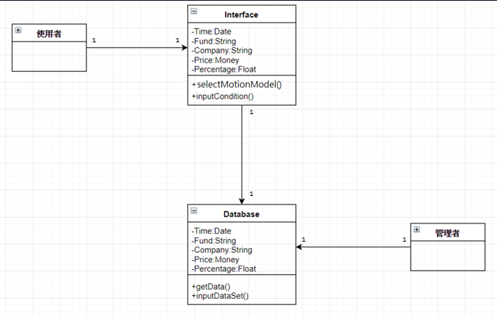

# 2018-nkust-oo
學號：0524070 姓名：陳品伸   
# 專題名稱:

網路爬蟲與資料分析實務-以中華民國證券投資信託暨顧問商業同業公會公布之基金投資明細-國內投資股票型為例   
# 組員: 

第24組

指導老師：曾守正教授

0524070 陳品伸

0524088 蔡宗益

# 主旨:
我們會利用python語言來進行爬蟲，利用python的套件來抓取中華民國證券投資暨顧問商業同業公會的網站資料，並將資料存入MySQL資料庫，再將其整理並進行分析，
最後再將分析結果以網站呈現。
# 專題內容簡介:

### 利害關係人目標表 

### 事件表

### 使用案例

### 使用案例圖

### 系統活動圖

### 系統循序圖

### 系統類別圖

### 測試計畫

